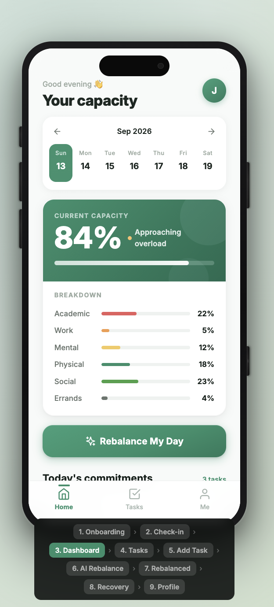
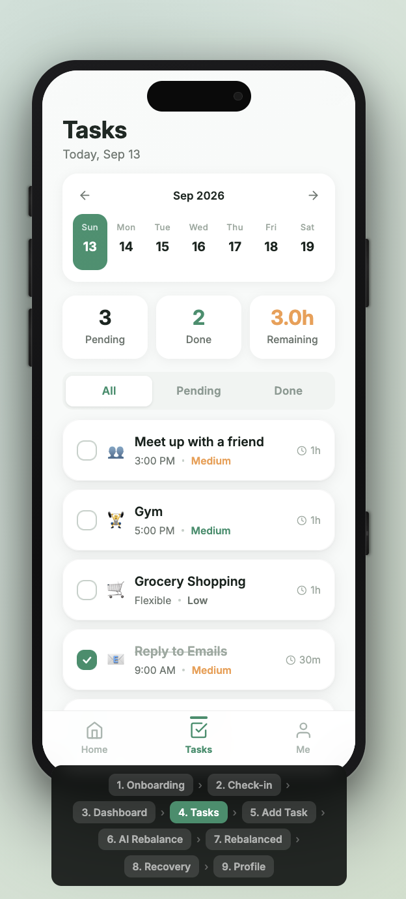
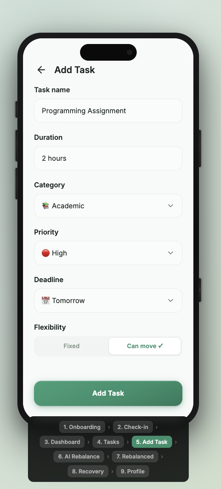
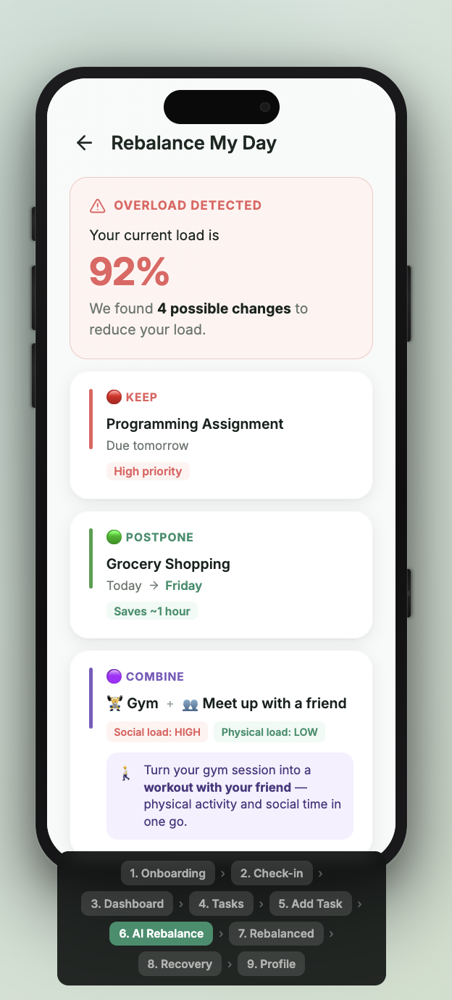
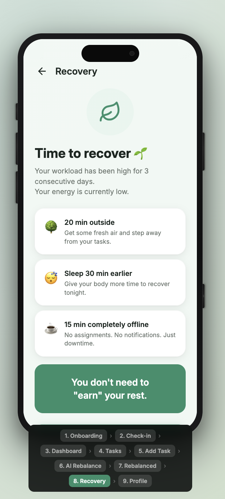
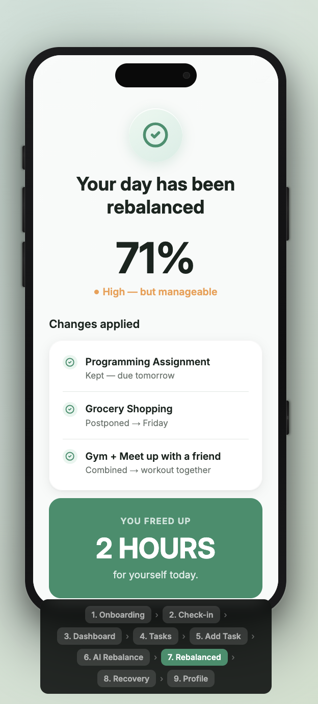

# Retime by Hunters

**Tagline:** _Manage your capacity, not just your tasks._

**Team:** Lim Jia Yu, Huam Jun Fei, Chai Juan Zhe, Nicholas Tong Xun \
**Problem Statement:** Stress & Workload Manager \
**Video Presentation:** [Unlisted YouTube Link] \
**Presentation Slides:** [Canva Presentation](https://canva.link/2ljpoewv2nrroww)

---

# 1. Project Overview

## The Problem

University students manage multiple responsibilities simultaneously, including academic work, part-time employment, social commitments, errands, exercise and personal wellbeing.

Burnout is rarely caused by a single task. Instead, it can develop when different types of workload accumulate without students having a clear understanding of their overall capacity.

Existing productivity tools generally focus on **what needs to be done**, rather than whether a student can realistically handle everything they have committed to. Students may continue accepting new commitments, postpone less urgent tasks, sacrifice sleep or recovery, and only recognise the problem once they are already exhausted.

### Stakeholders

- **University students** — Primary users who need to manage competing responsibilities.
- **Student clubs and societies** — May be affected when students become overloaded or disengaged.
- **Universities and student support services** — Benefit when students maintain healthier workloads and routines.
- **Friends, classmates and family** — May be affected by a student's availability and wellbeing.
- **Employers and part-time workplaces** — Depend on students being able to balance work and study.

### Existing Solutions

Several existing applications address parts of this problem, but they approach it from different directions.

**Todoist** focuses primarily on task management and prioritisation. It helps users answer:

> "What should I do first?"

However, it does not primarily answer:

> "Am I carrying too much overall?"

**Tiimo** combines calendars, to-do lists, routines, visual planning, AI planning and wellbeing features. It is closer to our concept, but its primary focus is visual planning and executive-function support rather than measuring a student's combined workload across academic, work, mental, physical, social and errand responsibilities.

**Finch** focuses strongly on self-care, goals and positive daily routines. However, it does not primarily solve the problem of balancing competing academic, work, social and personal commitments.

### The Gap

Existing solutions tend to focus on one or more of three areas:

**Productivity → Tasks**
**Wellbeing → Feelings**
**Planning → Time**

Retime connects these areas into one continuous cycle:

> **Workload → Capacity → Stress → Action → Recovery**

The key insight behind our solution is that students do not only need help organising their tasks. They need help recognising when their total commitments are becoming too much and deciding **what to change**.

## Our Solution

**Retime** is a mobile-first workload and wellbeing manager designed specifically for university students.

It combines task information, time commitments and quick wellbeing check-ins to estimate how much of a student's capacity is being consumed across different areas of life.

When excessive workload is detected, Retime recommends practical actions such as postponing low-priority tasks, reducing commitments, rescheduling flexible activities or protecting recovery time.

Instead of simply telling students that they are stressed or busy, Retime helps them **decide what to change**.

### Feature Set

#### 1. 📊 Student Capacity Dashboard

The dashboard provides an easy-to-understand overview of the student's current capacity.

> **"You're currently at 84% capacity."**

Workload is broken down into:

- 📚 Academic
- 💼 Work
- 🧠 Mental
- 🏃 Physical
- 👥 Social
- 🏠 Errands

This allows students to see the **combined impact** of different responsibilities rather than viewing every commitment separately.

---

#### 2. 📝 Smart Task Input & Calendar Import

Students can quickly add commitments manually or import existing events from their calendar.

Manual task input includes:

- Task name
- Duration
- Deadline
- Category
- Priority
- Flexibility

Example:

> **Programming Assignment** — 2 hours — Due tomorrow — Academic — High Priority — Flexible: No

The **flexibility** field allows Retime to distinguish between commitments that must happen at a specific time and those that can be moved, postponed or reduced.

Students can also import existing calendar events such as:

- 📚 Classes
- 📝 Assignment deadlines
- 💼 Work shifts
- 👥 Club meetings
- 📅 Personal events
- 🏃 Existing activities

Retime distinguishes between fixed commitments and flexible tasks. Fixed events such as classes and work shifts occupy specific time slots, while flexible tasks are evaluated using estimated effort, deadline, priority and flexibility.

---

#### 3. 🧠 Daily Wellbeing Check-in

A quick 30-second check-in records:

- Stress
- Energy
- Mood
- Sleep

The purpose is to capture the student's current state without turning wellbeing tracking into another assignment.

---

#### 4. 🤖 AI Load Balancer

When a student's workload becomes too high, Retime analyses their tasks, fixed commitments, wellbeing signals and category balance to recommend practical changes.

The system identifies what the student can:

- **KEEP** — Keep important commitments unchanged.
- **MOVE** — Shift a flexible task to a less busy time on the same day, keeping its deadline.
- **POSTPONE** — Push a lower-priority task to a later day, changing its deadline.
- **REDUCE** — Reduce the duration or intensity of a commitment.
- **PROTECT** — Protect essential recovery time.
- **COMBINE** — Modify an existing commitment so it supports more than one life category.

Example:

> **Social Load: HIGH**
> **Physical Load: LOW**
>
> **COMBINE** — Turn your existing meetup with a friend into a 30-minute walk.

This avoids adding another activity while improving balance across categories.

> **Retime doesn't just balance your tasks. It balances your life.**

---

#### 5. 🚨 Overload Detection

The system identifies patterns such as:

> ⚠️ **High Load Detected**
>
> Your workload has increased for three consecutive days while your energy has decreased.

Rather than simply displaying a warning, Retime immediately provides possible actions.

---

#### 6. 🌱 Recovery Nudges

When sustained high workload or low energy is detected, the application recommends recovery activities such as:

- Taking a short break
- Going outside
- Sleeping earlier
- Exercising
- Spending time with friends
- Taking an unscheduled period of downtime

The objective is to prevent Retime from becoming another productivity tool that simply encourages students to do more.

---

#### 7. 🆘 "I'm Overwhelmed" Mode

A student can press a single button:

> **I'm overwhelmed**

The app simplifies the day by identifying:

- What must be done
- What can be postponed
- What can be reduced
- What can be skipped
- When the student should recover

This provides an immediate intervention when students have too many commitments to organise everything themselves.

---

#### 8. 📈 Weekly Insights

Retime identifies workload and wellbeing patterns such as:

> "Your stress is highest on days when your workload exceeds 80%."

This helps students understand their own workload patterns and recognise their limits earlier.

---

# 2. Ideation & Process

## 2.1 Ideas We Considered

| **Idea**                                             | **Why it was dropped / kept**                                                                                                                           |
| ---------------------------------------------------- | ------------------------------------------------------------------------------------------------------------------------------------------------------- |
| **A. Capacity Dashboard + Load Visualiser (Chosen)** | Directly addresses the problem of students not knowing how much they are carrying. Provides an immediate and understandable overview of total workload. |
| **B. AI Load Balancer (Chosen)**                     | Goes beyond tracking by actively helping students decide what to postpone, reduce or move. This became one of the core differentiators of the solution. |
| **C. Overload Detection (Chosen)**                   | Allows the app to identify potential overload patterns before the student's workload becomes unmanageable.                                              |
| **D. Recovery Nudge System (Chosen)**                | Directly addresses the need for recovery instead of only improving productivity.                                                                        |
| **E. "I'm Overwhelmed" Mode (Chosen)**               | Provides a simple intervention when students are struggling to manage their existing workload.                                                          |
| **F. Mood/Stress Tracker**                           | Kept, but simplified. A full mental-health journal would increase complexity and could make the app feel like another task.                             |
| **G. Recovery Gamification**                         | Partially dropped. We considered points, streaks and achievements but decided excessive gamification could make recovery feel like another obligation.  |
| **H. Social Commitment Manager**                     | Partially kept. Social commitments contribute to workload, but a full social calendar was outside our MVP scope.                                        |
| **I. "Say No" Assistant**                            | Kept as a possible future feature. It could help students respond to new commitments but was not essential to the first prototype.                      |
| **J. AI Therapist / Mental Health Chatbot**          | Dropped. It moves beyond workload management and introduces unnecessary safety and medical concerns.                                                    |
| **K. Full Calendar Replacement**                     | Dropped. Existing calendar applications already perform this function well. Retime should work alongside scheduling tools rather than replace them.     |
| **L. Peer/Social Support Network**                   | Dropped from the MVP. Although potentially useful, it introduces privacy, moderation and social-platform complexity.                                    |

## 2.2 Ideation Boards

### ① Problem Tree


The problem tree shows the causes and consequences of student workload overload, helping the team identify the underlying problem rather than treating stress as an isolated issue.

### ② Idea Evolution / Brainstorm Board


This board shows how our initial productivity-focused concept evolved into a workload and capacity management solution.

### ③ Final User Flow


The final user flow demonstrates the intended cycle:

> **Capture → Measure → Detect → Rebalance → Recover**

---

## 2.3 Mentor Consultation

| **Date**   | **Mentor**  | **Feedback Received**                                                                                                                                                                                                                                                                                                                                                                                                                                                                                                                                                                                                               | **What Was Changed**                                                                                                             |
| ---------- | ----------- | ----------------------------------------------------------------------------------------------------------------------------------------------------------------------------------------------------------------------------------------------------------------------------------------------------------------------------------------------------------------------------------------------------------------------------------------------------------------------------------------------------------------------------------------------------------------------------------------------------------------------------------- | -------------------------------------------------------------------------------------------------------------------------------- |
| 13-09-2026 | Janelle Tan | **UI Feedback:**<br>• **Add Task & Planning:** Allow users to easily add and plan tasks for **today, tomorrow, and future dates**.<br>• **Flexibility & AI Balance:** Keep the system flexible while making the AI's workload balancing and recommendations more visible in the UI.<br>• **Navigation:** The **Task** button feels awkward in the navbar, consider moving it elsewhere.<br>• **Design:** Consider a different font and add more visual elements to make the UI feel more polished and engaging.<br><br>**AI Load Balancer:**<br>• **Move vs. Postpone:** These two options feel quite similar and may be confusing. | Clarified the difference between Move and Postpone, and adjusted the UI to make both actions more intuitive and distinguishable. |
|  |

# 3. Design & Prototype

**UI Prototype:** [Public Prototype Link](https://www.figma.com/make/oFvQalhYF8p988NIbjGoqP/Code-Nection?t=h6DT9ag8fJrofDL5-20&fullscreen=1)

The prototype focuses on demonstrating the key user journey rather than replacing existing calendar or productivity applications.

## Screen 1 — Onboarding

> **Know your load. Protect your capacity.**

The student selects their typical responsibilities:

- Study
- Work
- Social
- Exercise
- Errands

**Purpose:** Establish the different areas of life that contribute to workload.


---

## Screen 2 — Daily Check-in

> **How are you feeling?**
>
> **Stress**
> 😌 😐 😟 😣 😫
>
> **Energy**
> 1 2 3 4 5
>
> **Sleep**
> `[ 5.5 hours ]`
>
> **Mood**
> 🙂 😐 😞
>
> **[ Done ]**

**Purpose:** Add the human side of workload management without requiring a long questionnaire.


---

## Screen 3 — Home / Capacity Dashboard

> **Good evening 👋**
>
> **YOUR CAPACITY**
>
> Calendar
> 
> **84%**
>
> ████████████████░░░░
>
> ⚠️ Approaching overload
>
> Academic — 22%
> Work — 5%
> Mental — 12%
> Physical - 18%
> Social — 23%
> Errands - 4%
>
> **[ Rebalance My Day ]**

**Purpose:** Give the student an immediate understanding of their current workload and capacity.



---

## Screen 4 — Task Overview

> **Tasks**
>
> Calendar
>
> Pending '[3]' Done '[2]' Remaining '[3.0h]'
>
> Meet up with a friend
> Gym
> Grocery Shopping
> ~~Reply to Emails~~
> ~~Read Chapter 4~~
>
> **[ Add Task ]**

**Purpose:** Show the details of the tasks



---
## Screen 5 — Add Task

> **Add Task**
>
> Task name
> `[ Programming Assignment ]`
>
> Duration
> `[ 2 hours ]`
>
> Category
> `[ Academic ▼ ]`
>
> Priority
> `[ High ▼ ]`
>
> Deadline
> `[ Tomorrow ]`
>
> Flexibility
> `[ Can move ]`
>
> **[ Add Task ]**

**Purpose:** Capture enough information for the workload engine to estimate the impact of a commitment.



---

## Screen 6 — AI Rebalance

> ⚠️ **OVERLOAD DETECTED**
>
> Your current load is **92%**.
>
> We found 3 possible changes:
>
> 🔴 **KEEP**
> Programming Assignment
> Due tomorrow
>
> 🟢 **POSTPONE**
> Grocery Shopping → Friday
>
> 🟡 **COMBINE**
> Gym + Meet up with friends
>
> **Estimated new load:**
>
> **92% → 71%**
>
> **[ Apply Changes ]**

**Purpose:** Demonstrate Retime's main differentiating feature: helping students decide what to change rather than simply displaying their workload.



---

## Screen 7 — Rebalanced Announcment

> **Your day has been rebalanced**
> **71%**
>
> Changes applied
>
> Programming Assignment
> Kept - due tomorrow
>
> Grocery Shopping
> Postponed - Friday
>
> Gym + Meet up with friends
> Combined - workout together
>
> **YOU FREED UP**
> **2 HOURS**
> **for yourself today**
>
> **[Continue]**

**Purpose:** Provide positive reinforcement by summarizing the adjusted schedule and emphasizing the immediate benefit (e.g., freeing up 2 hours)


---

## Screen 8 — Recovery Recommendation

> 🌱 **TIME TO RECOVER**
>
> Your workload has been high for 3 consecutive days.
>
> Your energy is currently low.
>
> **We recommend:**
>
> 🌳 20 min outside
> 😴 Sleep 30 min earlier
> ☕ 15 min completely offline
>
> _You don't need to "earn" your rest._
>
> **[ Start Recovery ]**

**Purpose:** Close the intervention loop by helping the student recover rather than simply return to work.



---



---

## Screen 9 — Profile

> **Profile**
>
> Jordan Lee
> jordan@gmail.com
>
> Task Done `[142]` Streak `[7d]` Avg Load `[76%]`
>
> Load this week
>
> **Daily Check-in**
>
> Notification
> Goals & Limits
> Weekly Report
> Privacy
> Help & Feedback
>
> **[ Sign Out]**

**Purpose:** Offer a comprehensive view of the student's historical stats and habits to encourage long-term self-reflection and sustained balance.


---

# 4. What Makes It Different

Retime is not designed to be another to-do list.

Its core idea is:

> **Most productivity apps optimise the student's schedule. Retime optimises the student's capacity.**

## Comparison with Existing Solutions

| **Feature**                                   | **Todoist** | **Finch** | **Tiimo** | **Retime**  |
| --------------------------------------------- | ----------- | --------- | --------- | ----------- |
| Task management                               | ✅          | ✅        | ✅        | ✅          |
| Mood / wellbeing                              | Limited     | ✅        | ✅        | ✅          |
| Visual planning                               | ✅          | Limited   | ✅        | ✅          |
| AI planning                                   | Limited     | Limited   | ✅        | ✅          |
| Workload capacity                             | ❌          | ❌        | Limited   | **✅ Core** |
| Multi-area load                               | ❌          | Partial   | Partial   | **✅**      |
| Detect overload                               | ❌          | Partial   | Partial   | **✅ Core** |
| Suggest what to postpone                      | Partial     | ❌        | ✅        | **✅**      |
| Recovery intervention                         | ❌          | ✅        | ✅        | **✅ Core** |
| Designed specifically for university workload | ❌          | ❌        | ❌        | **✅**      |

## The Novel Twist

The most important feature is not simply **AI**.

The novel combination is:

> **Workload measurement + wellbeing signals + AI-assisted intervention + recovery**

Instead of saying:

> "You have 12 tasks today."

Retime can say:

> **"Your capacity is at 92%. Keep your urgent assignment, move the gym session, postpone groceries and protect 30 minutes for recovery."**

This transforms Retime from a **tracking tool** into an **intervention tool**.

---

# 5. Technical Architecture & Feasibility

## Tech Stack

### Frontend — Flutter

**Why Flutter?**

- Cross-platform development
- Mobile-first design
- Fast UI development
- Suitable for Android and iOS
- Supports interactive dashboards and charts

For the hackathon MVP, we can prioritise **Android** for demonstration while keeping the architecture cross-platform.

---

### Backend — Node.js + Express

The backend handles:

- User data
- Tasks
- Wellbeing check-ins
- Workload calculations
- AI requests
- Recommendations
- Recovery actions

Node.js + Express allows the team to quickly build REST APIs and integrate external AI services.

---

### Database — Supabase PostgreSQL

The database stores:

- Users
- Tasks
- Wellbeing Check-ins
- Workload Scores
- Recommendations
- Recovery Actions

Supabase is suitable for the MVP because it provides a hosted PostgreSQL database and reduces the infrastructure that needs to be managed during the hackathon.

---

### AI — Gemini API

Gemini is used primarily for:

- Analysing workload situations
- Explaining why a student may be overloaded
- Suggesting which flexible tasks can be moved
- Generating personalised recovery suggestions

Importantly, Retime will **not rely on AI for the core workload calculation**.

The system calculates workload using predefined rules, while AI provides recommendations based on structured workload information.

This makes the system more predictable, controllable and easier to demonstrate.

---

## Workload Engine

A simplified workload calculation can be represented as:

> **Capacity Score = Time Load + Mental Load + Physical Load + Social Load + Errand Load**

Example:

| Category  |    Load |
| --------- | ------: |
| Academic  |     40% |
| Work      |     20% |
| Mental    |     15% |
| Physical  |      5% |
| Social    |      8% |
| Errands   |      4% |
| **Total** | **92%** |

The exact weights can be calibrated during testing.

The system can then classify the overall capacity as:

| Capacity | Status         |
| -------: | -------------- |
|    0–49% | 🟢 Comfortable |
|   50–69% | 🟡 Moderate    |
|   70–84% | 🟠 High        |
|  85–100% | 🔴 Overloaded  |

These thresholds are **application design rules and are not medical measurements**.

---

## System Architecture

```text
                    ┌──────────────────────┐
                    │      Flutter App     │
                    │   Mobile Frontend    │
                    └──────────┬───────────┘
                               │
                               │ REST API
                               ▼
                    ┌──────────────────────┐
                    │   Node.js + Express  │
                    │       Backend        │
                    └──────┬─────────┬─────┘
                           │         │
                ┌──────────┘         └──────────┐
                ▼                               ▼
      ┌──────────────────┐            ┌──────────────────┐
      │ Supabase         │            │   Gemini API     │
      │ PostgreSQL       │            │   AI Analysis    │
      └──────────────────┘            └──────────────────┘
                │
                ▼
      ┌──────────────────┐
      │ Workload Engine  │
      │ Rule-based Load  │
      │ Calculation      │
      └──────────────────┘
```

The architecture separates **workload calculation** from **AI recommendations**.

This ensures that the AI does not directly determine a student's capacity score. Instead, the application calculates structured workload data first and then provides this information to Gemini for recommendation generation.

---

# Build Plan & Scope

The MVP will be developed in phases to ensure that the core user experience remains achievable within the available development time.

## Phase 1 — Core Application

Build:

- User onboarding
- Dashboard
- Task creation
- Task categories
- Priority and deadline
- Flexibility settings
- Basic workload calculation
- Calendar import

**Goal:** The user can see their current capacity.

---

## Phase 2 — Wellbeing Layer

Build:

- Stress check-in
- Energy check-in
- Sleep input
- Mood input
- Historical check-in data

**Goal:** Connect workload with the student's current wellbeing state.

---

## Phase 3 — AI Load Balancer

Build:

- Overload detection
- AI analysis
- Suggested task changes
- Move recommendations
- Postpone recommendations
- Reduce recommendations
- Explanation of recommendations

**Goal:** Transform Retime from a tracker into an intervention tool.

---

## Phase 4 — Recovery

Build:

- Recovery recommendations
- Recovery timer/activity
- Overload recovery screen
- Daily recovery suggestion

**Goal:** Ensure the app helps students recover rather than simply encouraging them to complete more tasks.

---

## Phase 5 — Polish & Deployment

Final work:

- Responsive mobile UI
- Accessibility
- Error handling
- Loading states
- Demo data
- Testing
- Backend deployment
- Database deployment
- Android APK build

**Final MVP Goal:**

A student should be able to:

> **Add commitments → See their capacity → Receive an overload warning → Get AI-powered suggestions → Rebalance their workload → Recover**

---

# Conclusion

Retime is designed around a simple idea:

> **Students don't just need to manage their tasks. They need to manage their capacity.**

By combining workload measurement, wellbeing signals, overload detection, AI-assisted intervention and recovery recommendations, Retime aims to help students recognise excessive workload **before it becomes overwhelming**.

> **Retime — Manage your capacity, not just your tasks.**
